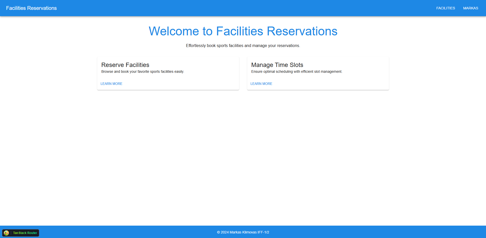
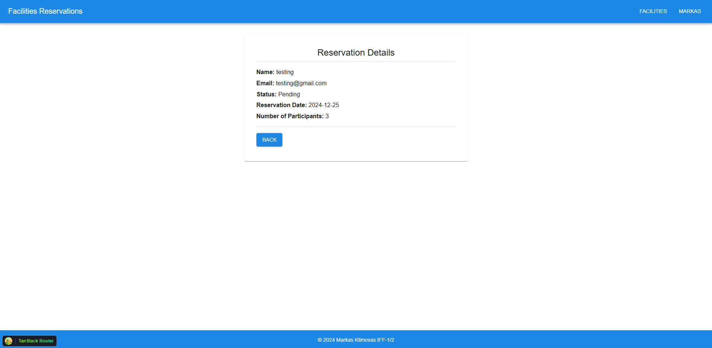
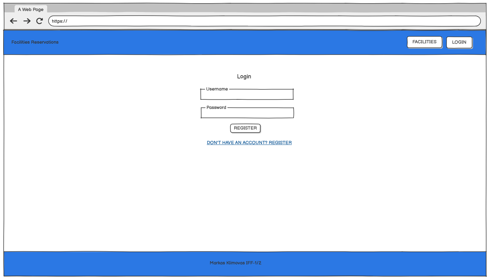
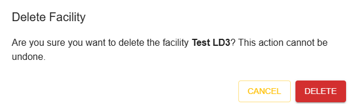
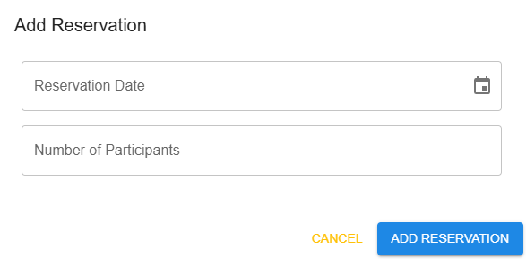

# Sports  Facility Booking System
Lab assignment for T120B165 module

The Sports Facility Booking System helps users book times at various sports facilities, including tennis courts, soccer fields, swimming pools, and gyms. Users can view available time slots, make and cancel reservations, and access past booking information.

# Functional Requirements
User Roles

    Guest Users:
        Register and log in.
        View facilities and available time slots, reservations.
    Members:
        Make, edit reservations.
    Facility Administrators:
        Manage reservations (add, edit, delete created facilities, time slots, reservations).
    System Administrators:
        Add, edit facilities, time slots, reservations off all users.

# System architecture


Technology Stack

    Backend: .NET
    Frontend: React
    Database: PostgreSQL

# User interface

## Main page
### Wireframe


### Actual


## Facilities page
### Wireframe

### Actual


## Facility page
### Wireframe

### Actual


## Time Slot page
### Wireframe

### Actual


## Reservation page
### Wireframe

### Actual


## Register page
### Wireframe

### Actual


## Login page
### Wireframe

### Actual


## Forms
### Create Facility Form


### Delete Facility Form


### Create Time Slot Form


### Create Reservation Form


# API Specification

### Base URL
```
http://localhost:5208/api/v1
```

---

## Endpoints

## Authentication Endpoints

### Register a New User

**POST** `/authentication/register`

Registers a new user.

**Request Body:**
```json
{
  "username": "string",
  "email": "user@example.com",
  "password": "string"
}
```

**Responses:**
- **201**: User registered successfully
- **400**: Bad Request

### Login

**POST** `/authentication/login`

Logs in a user.

**Request Body:**
```json
{
  "email": "user@example.com",
  "password": "string"
}
```

**Responses:**
- **200**: Login successful, appends refresh token to user's cookies
  ```json
  {
    "id": "20514bd1-f3f2-4559-bca5-f2f89d94beab",
    "userName": "name",
    "email": "name@email.com",
    "accessToken": "20514bd1-f3f2-4559-bca5-f2f89d94beab20514bd1-f3f2-4559-bca5-f2f89d94beab20514bd1-f3f2-4559-bca5-f2f89d94beab",
    "roles": ["admin", "member"]
  }
  ```
- **401**: Unauthorized

### Refresh Authentication Tokens

**POST** `/authentication/accessToken`

Refreshes authentication tokens.

**Responses:**
- **200**: Token refreshed successfully
  ```json
  {
    "accessToken": "20514bd1-f3f2-4559-bca5-f2f89d94beab20514bd1-f3f2-4559-bca5-f2f89d94beab20514bd1-f3f2-4559-bca5-f2f89d94beab"
  }
  ```
- **400**: Bad Request
- **422**: Unprocessable Entity

### Logout

**POST** `/authentication/logout`

Logs out the user.

**Responses:**
- **200**: User logged out successfully
- **400**: Bad Request
- **422**: Unprocessable Entity

### Facility

#### **Get a list of facilities**
`GET /facility`

**Summary:** Retrieves a list of facilities.

**Responses:**
- `200 OK`: A list of facilities.
  ```json
  [
    {
      "id": 1,
      "facilityType": "Gym",
      "name": "Sporto klubas",
      "address": "Kauno g. 67, Kaunas",
      "description": "Sporto klubas jūsų tikslams įvykdyti.",
      "pictureUrl": "https://shorturl.at/...",
      "phoneNumber": "37064444444",
      "emailAddress": "sveikata@klubas.com",
      "maxNumberOfParticipants": 1,
      "facilityTypeId": 1
    }
  ]
  ```
- `404 Not Found`: Facility not found.

---

#### **Create a new facility**
`POST /facility`

**Summary:** Creates a new facility.

**Request Body:**
```json
{
  "name": "Sporto klubas",
  "address": "Kauno g. 67, Kaunas",
  "description": "Sporto klubas jūsų tikslams įvykdyti.",
  "pictureUrl": "https://shorturl.at/...",
  "phoneNumber": "37064444444",
  "emailAddress": "sveikata@klubas.com",
  "maxNumberOfParticipants": 1,
  "facilityTypeId": 1
}
```

**Responses:**
- `201 Created`: Facility created successfully.
- `400 Bad Request`: Invalid request payload.
- `422 Unprocessable Entity`: Unable to process the request.

---

#### **Get a facility by ID**
`GET /facility/{id}`

**Summary:** Retrieves a facility by its ID.

**Parameters:**
- `id` (integer, required): ID of the facility.

**Responses:**
- `200 OK`: Facility details.
- `404 Not Found`: Facility not found.

---

#### **Update a facility by ID**
`PUT /facility/{id}`

**Summary:** Updates a facility by its ID.

**Parameters:**
- `id` (integer, required): ID of the facility.

**Request Body:**
```json
{
  "name": "Updated Facility Name",
  "address": "Updated Address",
  "description": "Updated description.",
  "pictureUrl": "https://updated-url.com",
  "phoneNumber": "37060000000",
  "emailAddress": "updated@facility.com",
  "maxNumberOfParticipants": 5,
  "facilityTypeId": 2
}
```

**Responses:**
- `200 OK`: Facility updated successfully.
- `400 Bad Request`: Invalid request payload.
- `422 Unprocessable Entity`: Unable to process the request.

---

#### **Delete a facility by ID**
`DELETE /facility/{id}`

**Summary:** Deletes a facility by its ID.

**Parameters:**
- `id` (integer, required): ID of the facility.

**Responses:**
- `204 No Content`: Facility deleted successfully.
- `404 Not Found`: Facility not found.

---

### Time Slot

#### **Get time slots for a facility**
`GET /facility/{facilityId}/timeSlot`

**Summary:** Retrieves time slots for a specific facility.

**Parameters:**
- `facilityId` (integer, required): ID of the facility.

**Responses:**
- `200 OK`: A list of time slots.
- `404 Not Found`: Facility or time slots not found.

---

#### **Create a time slot for a facility**
`POST /facility/{facilityId}/timeSlot`

**Summary:** Creates a time slot for a specific facility.

**Parameters:**
- `facilityId` (integer, required): ID of the facility.

**Request Body:**
```json
{
  "startTime": "2024-01-01T10:00:00Z",
  "endTime": "2024-01-01T11:00:00Z"
}
```

**Responses:**
- `200 OK`: Time slot created successfully.
- `400 Bad Request`: Invalid request payload.
- `422 Unprocessable Entity`: Unable to process the request.

---

#### **Get a time slot by ID**
`GET /facility/{facilityId}/timeSlot/{id}`

**Summary:** Retrieves a time slot by its ID.

**Parameters:**
- `facilityId` (integer, required): ID of the facility.
- `id` (integer, required): ID of the time slot.

**Responses:**
- `200 OK`: Time slot details.
- `404 Not Found`: Time slot not found.

---

#### **Update a time slot by ID**
`PUT /facility/{facilityId}/timeSlot/{id}`

**Summary:** Updates a time slot by its ID.

**Parameters:**
- `facilityId` (integer, required): ID of the facility.
- `id` (integer, required): ID of the time slot.

**Request Body:**
```json
{
  "startTime": "2024-01-01T12:00:00Z",
  "endTime": "2024-01-01T13:00:00Z"
}
```

**Responses:**
- `200 OK`: Time slot updated successfully.
- `400 Bad Request`: Invalid request payload.
- `422 Unprocessable Entity`: Unable to process the request.

---

#### **Delete a time slot by ID**
`DELETE /facility/{facilityId}/timeSlot/{id}`

**Summary:** Deletes a time slot by its ID.

**Parameters:**
- `facilityId` (integer, required): ID of the facility.
- `id` (integer, required): ID of the time slot.

**Responses:**
- `204 No Content`: Time slot deleted successfully.
- `404 Not Found`: Time slot not found.

---

### Reservation

#### **Get reservations for a time slot**
`GET /facility/{facilityId}/timeSlot/{timeSlotId}/reservation`

**Summary:** Retrieves reservations for a specific time slot.

**Parameters:**
- `facilityId` (integer, required): ID of the facility.
- `timeSlotId` (integer, required): ID of the time slot.

**Responses:**
- `200 OK`: A list of reservations.
- `404 Not Found`: Reservations not found.

---

#### **Create a reservation**
`POST /facility/{facilityId}/timeSlot/{timeSlotId}/reservation`

**Summary:** Creates a reservation.

**Request Body:**
```json
{
  "reservationDate": "2024-01-01T10:00:00Z",
  "numberOfParticipants": 2
}
```

**Responses:**
- `200 OK`: Reservation created successfully.
- `400 Bad Request`: Invalid request payload.
- `422 Unprocessable Entity`: Unable to process the request.

---

#### **Get a reservation by ID**
`GET /facility/{facilityId}/timeSlot/{timeSlotId}/reservation/{id}`

**Summary:** Retrieves a reservation by its ID.

**Parameters:**
- `facilityId` (integer, required): ID of the facility.
- `timeSlotId` (integer, required): ID of the time slot.
- `id` (integer, required): ID of the reservation.

**Responses:**
- `200 OK`: Reservation details.
- `404 Not Found`: Reservation not found.

---

#### **Update a reservation by ID**
`PUT /facility/{facilityId}/timeSlot/{timeSlotId}/reservation/{id}`

**Summary:** Updates a reservation by its ID.

**Parameters:**
- `facilityId` (integer, required): ID of the facility.
- `timeSlotId` (integer, required): ID of the time slot.
- `id` (integer, required): ID of the reservation.

**Request Body:**
```json
{
  "reservationDate": "2024-01-01T12:00:00Z",
  "numberOfParticipants": 3
}
```

**Responses:**
- `200 OK`: Reservation updated successfully.
- `400 Bad Request`: Invalid request payload.
- `422 Unprocessable Entity`: Unable to process the request.

---

#### **Delete a reservation by ID**
`DELETE /facility/{facilityId}/timeSlot/{timeSlotId}/reservation/{id}`

**Summary:** Deletes a reservation by its ID.

**Parameters:**
- `facilityId` (integer, required): ID of the facility.
- `timeSlotId` (integer, required): ID of the time slot.
- `id` (integer, required): ID of the reservation.

**Responses:**
- `204 No Content`: Reservation deleted successfully.
- `404 Not Found`: Reservation not found.

--- 

# Conclusions
- API was created using REST principles with .NET. 
- PostgreSQL was used for the database. 
- React.js was used for the client-side. 
- JWT tokens were used for authentication/authorization. 
- The server-side components are accessible via the cloud.


